# Integrate a virtual mirror with e-commerce products

Virtual try on apps have the full potential to become the next big thing in e-commerce. They relieve much of the stress of going into a store and physically try on different products. They save consumers’ time and brands’ budget, serving as a cost-effective yet convenient alternative for trying on products.Most importantly, it makes choosing products we'll love as easy as watching in the mirror.

In this code pattern, we will develop a hybrid mobile application using Mobile First Foundation integrated with recommendation system based on Watson Visual Recognition , which takes in an image of the user as an input and based on his/her features(like age, gender, etc), it returns a personalized recommendation of jewellery products. The user can later try these jewellery products virtually using the virtual mirror feature.

When the reader has completed this Code Pattern, they will understand how to:

* Connect to Mobile First Foundation using a mobile application.
* Take inputs from mobile application and do required processing on IBM Cloud.
* Use Watson Visual Recognition using a mobile application.
* Deploy and use cloud foundry applications.
* Access images from Cloud Object Storage using a mobile application.
* Connect and access Db2 on Cloud.

<!--add an image in this path-->
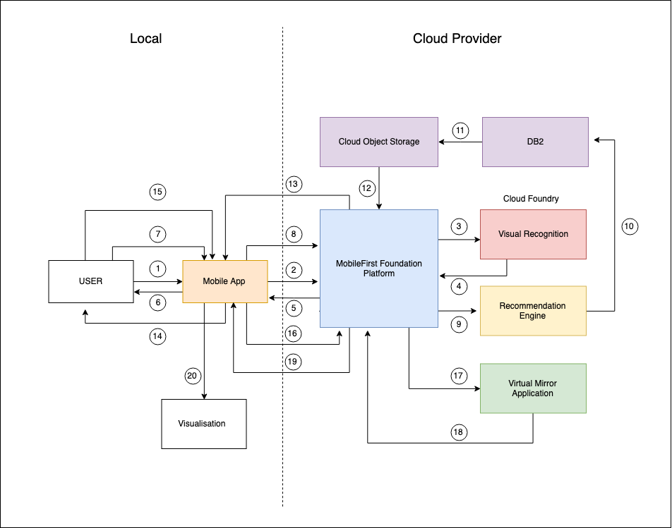

<!--Optionally, add flow steps based on the architecture diagram-->
## Flow

1. Take input from user's mobile.
2. Send the input to the recommendation system application via Mobile First Foundation.
3. Interact with the Db2 on Cloud to get details of the required products.
4. Send the recommended products to the to the user's mobile via Mobile First Foundation.
5. Send the input to the Virtual Mirror application via Mobile First Foundation and visualize on virtual mirror.

<!--Optionally, update this section when the video is created-->
# Watch the Video

## Pre-requisites

* [IBM Cloud account](https://www.ibm.com/cloud/) : Create an IBM Cloud account.
* [Python 3](https://www.python.org/downloads/): Install python 3.
* [Java 1.8.x](https://www.oracle.com/technetwork/java/javase/downloads/jdk8-downloads-2133151.html): Make sure you have required version (Java 1.8.x).

# Steps

Please follow the below to setup and run this code pattern.

1. [Clone the repo](#1-clone-the-repo)
2. [Recomendation Engine Setup](#2-recomendation-engine-setup)
3. [Virtual Mirror Setup](#3-virtual-mirror-setup)
4. [Watson Visual Recognition Setup](#4-watson-visual-recognition-setup)
5. [Mobile Application Setup](#5-mobile-application-setup)


### 1. Clone the repo

Clone this [git repo](https://github.ibm.com/raravi86/Virtual-Mirror.git).
Else, in a terminal, run:

```
$ git clone https://github.com/RahulReddyRavipally/Virtual-Mirror.git
```
### 2. Recommendation Engine Setup

In this step we will be building a recommendation engine which takes users's age and gender as input ,and gives out a recommendation accordingly.

#### 2.1. Sign up for IBM Cloud Object Storage
We use [IBM Cloud Object Storage](https://cloud.ibm.com/catalog/services/cloud-object-storage) to store the jewellery images required for recommendation and the dataset.
##### 2.1.1 Create IBM Cloud Object Storage

* In the `IBM Cloud Dashboard`, click on `Catalog` and select `Object Storage` service under `Infrastructure` -> `Storage`. Click on `Create` as shown below.
  
* The IBM Cloud Object Storage dashboard will get shown. In the `Buckets` tab, click on `Create bucket`. Give an unique name for the bucket. Set the selections for Resiliency (`Cross Region`), Location (`us-geo`) and Storage class (`Standard`), and click on `Create` as shown below.
  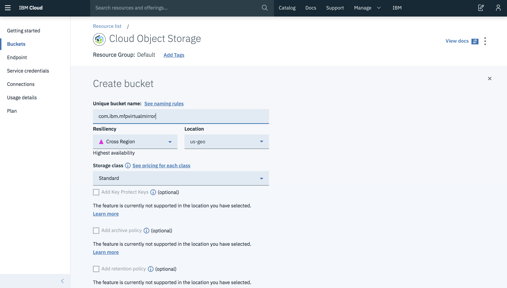

<b>Note: Make a note of the `Bucket Name` as it is Important and will be used in step 5.4.2</b>

##### 2.1.2 Create Service ID and API Key for accessing objects
* Create Service ID
  * In a separate browser tab/window, launch the IBM Cloud Identity & Access Management dashboard using URL https://cloud.ibm.com/iam/.
  * In case you have multiple IBM Cloud accounts, then select the target Account, Region, Organization and Space.
  * Under `Identity & Access` (on the left side of the page), select `Service IDs` and click `Create` on the right top of the page. Give a name and description, and click Create.
  * Make a note of the name of the Service ID as shown below.


  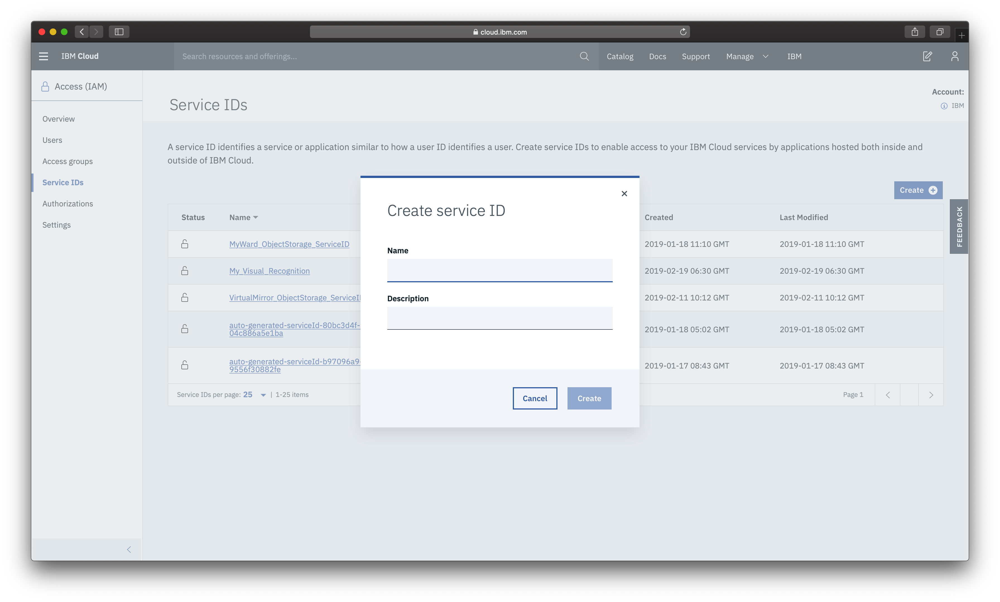

<b>Note: Make a note of the `name` of the Service ID as it is Important and will be used in step 5.4.2</b>

* Add Cloud Object Storage Writer role to that service ID

  * Back in IBM Cloud Object Storage dashboard, select `Bucket permissions` under `Buckets` click on `policies`.
  * Click on `Service IDs` tab. Under `Select a service ID`, select the service ID created in the above step. Under `Assign a role to this service ID for this bucket`, select `Writer`. Click Create policy as shown below.


  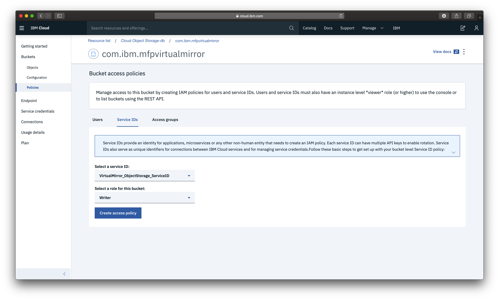

You should get a confirmation dialog saying “Service permission created“.
* Create API Key

  * Back in IBM Cloud Identity & Access Management dashboard, under `Service IDs`, click on the service ID created earlier. Under `Access policies`, you should see the `Writer` role for your bucket.
  * Click on `API keys` tab and then click on `Create` button. In the `Create API key` dialog, give a name and description for the API key and click on `Create`. You should get a confirmation dialog saying `API key successfully created` as shown below.
  * Click on `Download` and save the API key as shown below. Note: This is the only time you will see the key. You cannot retrieve it later.
  * You can now close the tab.
  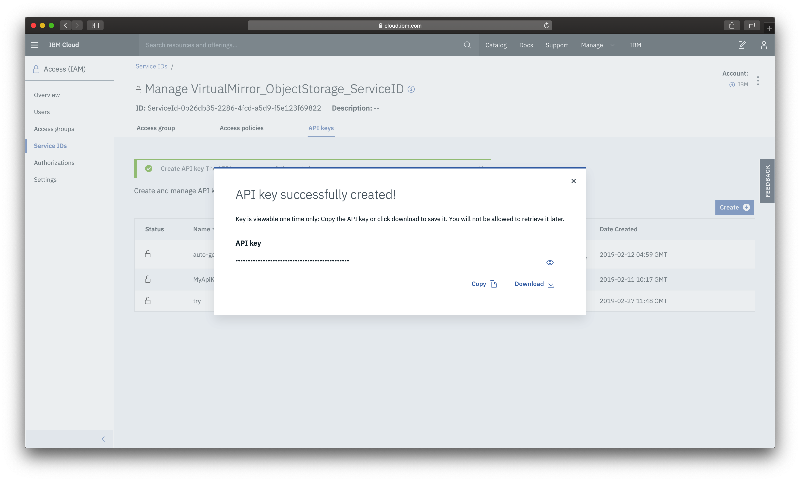

<b>Note: Make a note of the `API Key` as it is Important and will be used in step 5.4.2</b>

#### 2.2.Add the IBM Cloud Object Storage credentials to the python application

To access the Cloud Object Storage service programmatically, you need to copy in your credentials, which you can find in your IBM Cloud Object Storage service credentials in IBM Cloud.

* Open your [IBM Cloud Data Resource list](https://cloud.ibm.com/resources). A list of your provisioned resources is displayed.
* Locate your **Cloud Object Storage** instance under `Storage` tab and click on that.
* Open the `Service Credentials` tab on the right hand side of the page and give a name.

  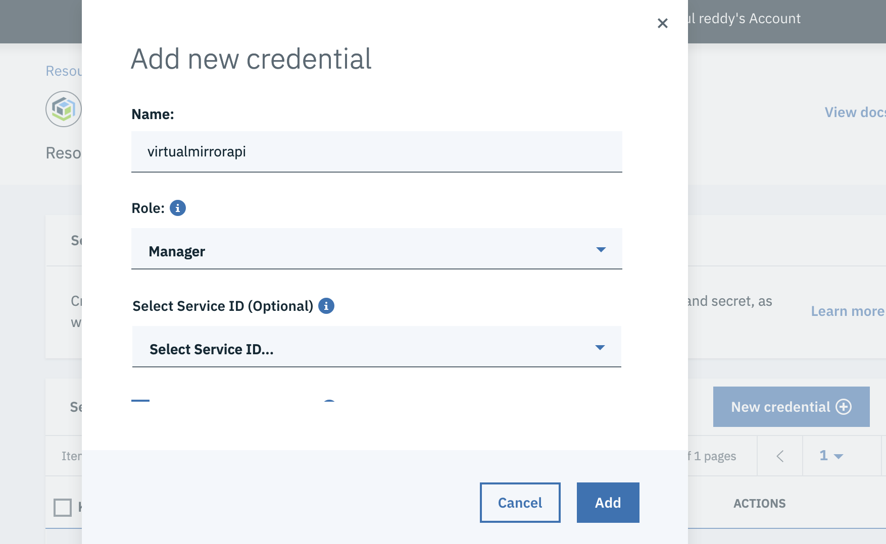

* Select Include HMAC Credentials as shown bellow.

  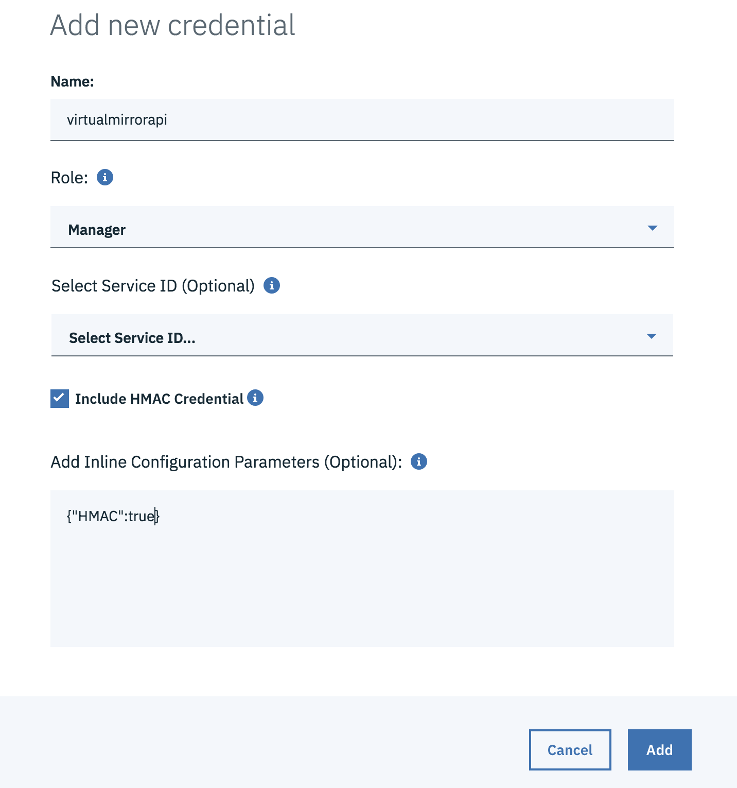

* View your credentials by clicking `View Credentials`.

  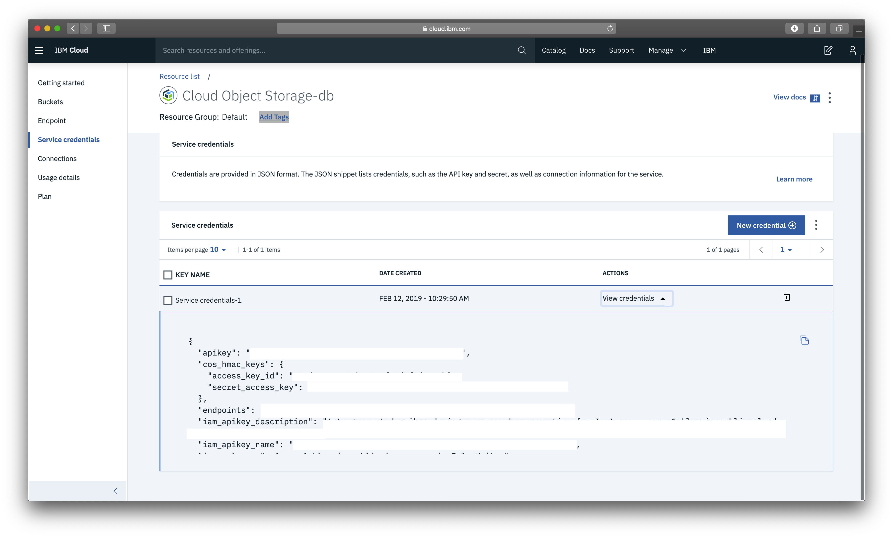

* Copy your credentials. Create a file `credentials1.json` and paste the copied credentials into this file.Place this file in the directory `JewelleryRecommendation` and also in the directory `UploadProductsCOS`.
* Replace `xxxxxx` in the place holder `bucket_name` with your corresponding bucket name in the file `KMeans_200.py`.

  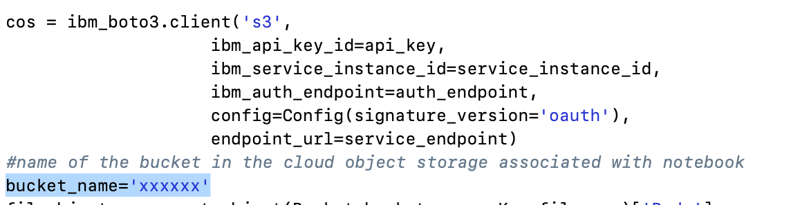

##### 2.2.1 Upload Images to cloud object Storage

* Replace `xxxxxx` in the place holder `bucket_name` with your corresponding bucket name in the file `upload.py`.
* Run the file `upload.py` locally to upload images and dataset to Cloud Object Storage.

```
$ python3 upload.py

```


#### 2.3. Sign up for IBM Db2 on Cloud Service

* Create a IBM Db2 instance [IBM db2](https://cloud.ibm.com/catalog/services/db2).

#### 2.4. Load product details into Db2

* Lanch your Db2 on cloud and click on `load`, as shown below.

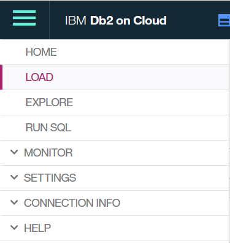

* Click on `browse files` and upload `products.csv`, as shown below. `products.csv` can be found in the root folder of `ProductDetailsDB2`.

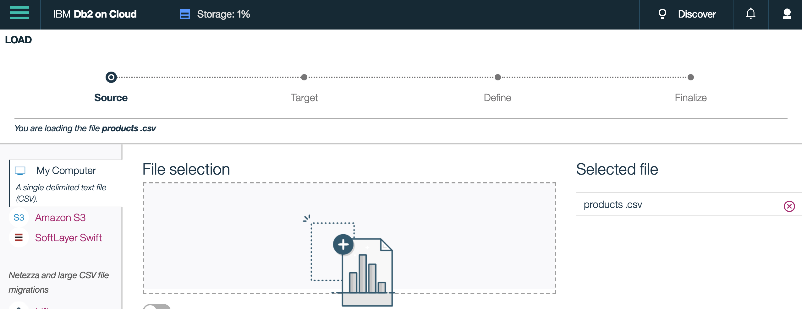

* Choose the default schema and create a table `PRODUCTS`, as shown below.

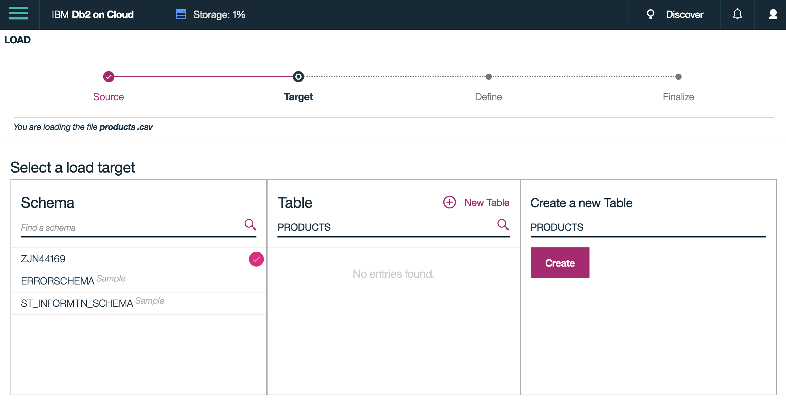

* Click on `Next`, as shown below.

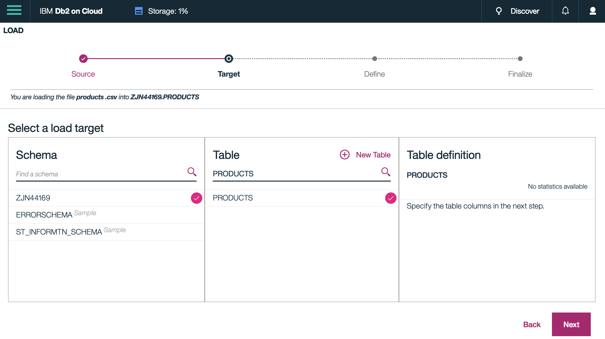

* Click on `Next`.

* Click on `Begin Load`, as shown below.

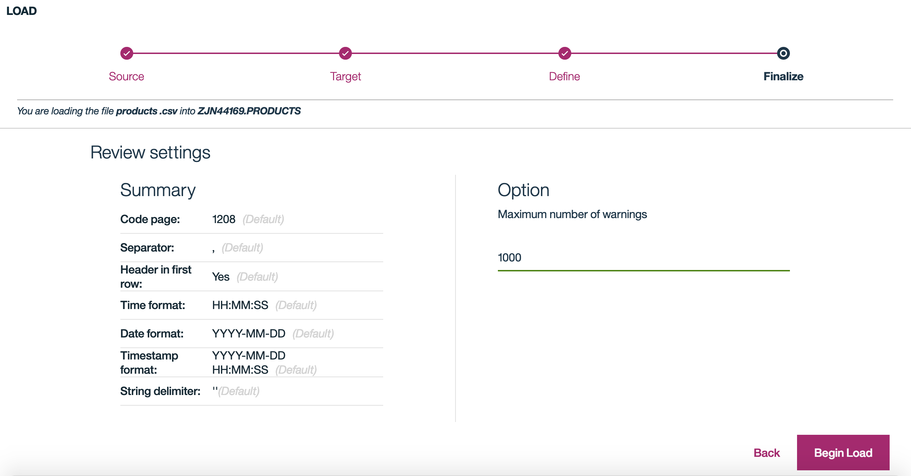

* Once the data is loaded, you can view the table which will look like the image, shown below.

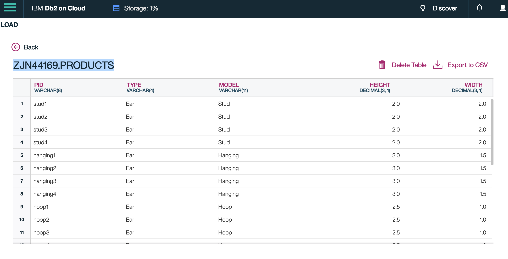

> NOTE: Make sure you note down the table name. In my case the table name is `ZJN44169.PRODUCTS`.


#### 2.5. Add the IBM db2 credentials to the python application

* Replace the placeholder `username`, `password`, `sg_service_url`, `database`, `host`, `port` under `credentials_1` in the file `KMeans_200.py`.
* Replace `XXXX.YYYY` in the place holder `insert` with your corresponding table name in the file `KMeans_200.py`.

> NOTE: You can get username, password, sg_service_url, hostname, port number and Database credentials by creating/clicking New Credentials from your Db2 service instance on cloud.

  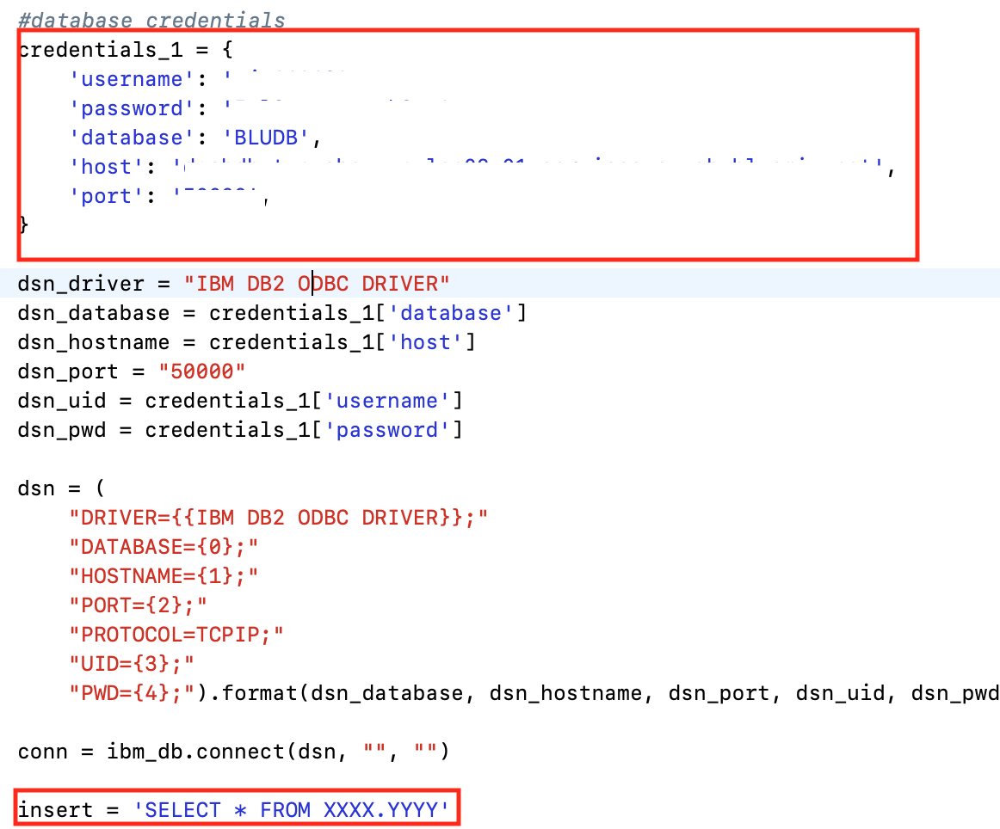


#### 2.6. Deploy python application to cloud foundry

* Create a cloud foundry instance [IBM Cloud Foundry Service](https://cloud.ibm.com/catalog/starters/python) and follow set of instructions for deploying python application to IBM Cloud Foundry.

 

<b>NOTE: Make Sure the Cloud Foundry App gets at least `256MB` of Memory. You can verify it by going to `IBM Cloud Dashboard > Resources > Cloud Foundry Apps > YOUR_APP_NAME`.</b>

* Use IBM Cloud command line interface to download, modify, and redeploy your Cloud Foundry applications and service instances.

* Before you begin, download and install the IBM Cloud [CLI](https://cloud.ibm.com/docs/cli?topic=cloud-cli-ibmcloud-cli&locale=en-us#overview).

* After you install the command line interface, you can get started.

* Change to the directory.

```
$ cd JewelleryRecommendation
```
>Note : Make sure that `KMeans_200.py`, `credentials1.json`, `requirements.txt`, `manifest.yml` and `Procfile` is present in the directory `JewelleryRecommendation`.

* Connect and log in to IBM Cloud.

```
$ ibmcloud api https://api.eu-gb.bluemix.net
```

```
$ ibmcloud login -u example@in.ibm.com -o example@in.ibm.com -s dev
```

>NOTE: If you are using a federated ID, use the `-sso` option.
```
$ ibmcloud login  -o example@in.ibm.com -s dev -sso
```
>NOTE: You must add single or double quotes around `username`, `org_name`, and `space_name` if the value contains a space, for example, `-o "my org"`.

* Finally Deploy the application by following command.
```
$ ibmcloud cf push YOUR-APP-NAME
```
>Example: ibmcloud cf push recommendation-engine

* Once you have deployed the application Make a note of the `URL` of the instance by right clicking on the `Visit app URL` and copying the link.

  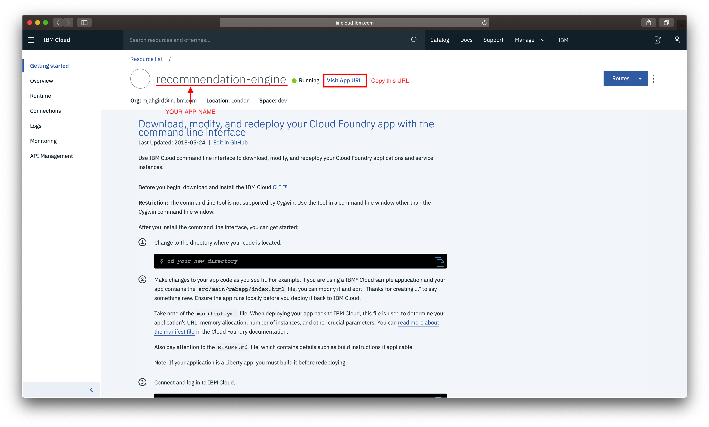

<b>Note: This `URL` is Important as it will be used in step 5.4.2</b>


#### 2.7. Test your deployment

To Test your deployment use any REST Clients like [Postman](https://www.getpostman.com/downloads/).
After Installing postman type  https://YOUR-APP-URL/?age=40&name=Kavya&gender=F to test whether Recommendation engine works.

 * Now click on `Send` button to run the `GET /` API. The API response should be shown in the `Response Body` as shown in snapshot below.


 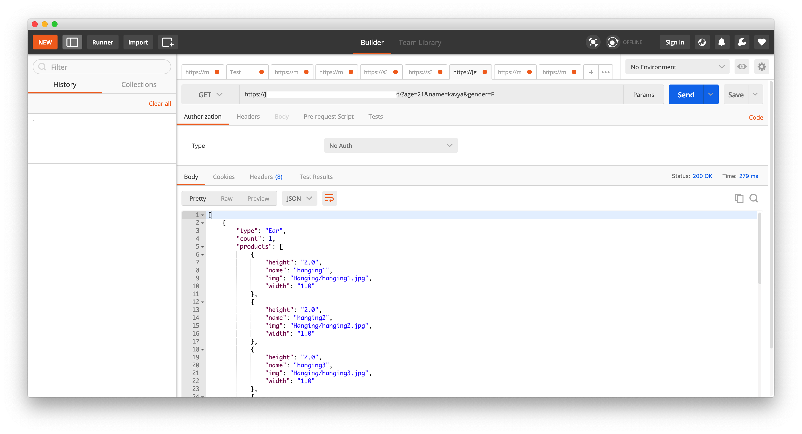


### 3. Virtual Mirror Setup

* Create a cloud foundry instance [IBM Cloud Foundry Service](https://cloud.ibm.com/catalog/starters/sdk-for-nodejs) and follow set of instructions for deploying JavaScript application to IBM Cloud Foundry.

 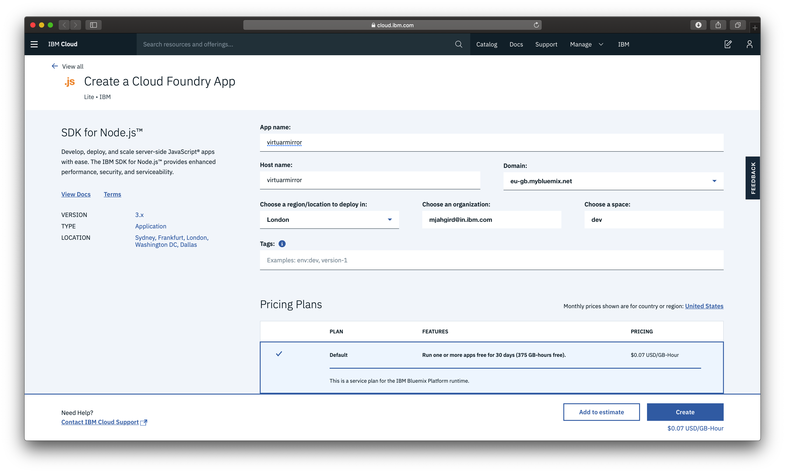

<b>NOTE: Make Sure the Cloud Foundry App gets at least `256MB` of Memory. You can verify it by going to `IBM Cloud Dashboard > Resources > Cloud Foundry Apps > YOUR_APP_NAME`.</b>

* Use IBM Cloud command line interface to download, modify, and redeploy your Cloud Foundry applications and service instances.

* Before you begin, download and install the IBM Cloud [CLI](https://cloud.ibm.com/docs/cli?topic=cloud-cli-ibmcloud-cli&locale=en-us#overview).

* After you install the command line interface, you can get started.

* Go to the `VirtualMirror` directory.

```
$ cd VirtualMirror
```

* Connect and log in to IBM Cloud.

```
$ ibmcloud api https://api.eu-gb.bluemix.net
```

```
$ ibmcloud login -u example@in.ibm.com -o example@in.ibm.com -s dev
```

>NOTE: If you are using a federated ID, use the `-sso` option.
```
$ ibmcloud login  -o example@in.ibm.com -s dev -sso
```
>NOTE: You must add single or double quotes around `username`, `org_name`, and `space_name` if the value contains a space, for example, `-o "my org"`.

* Finally Deploy the application by following command.
```
$ ibmcloud cf push YOUR-APP-NAME
```
>Example: ibmcloud cf push virtual-mirror

* Once you have deployed the application Make a note of the `URL` of the instance by right clicking on the `Visit app URL` and copying the link.

  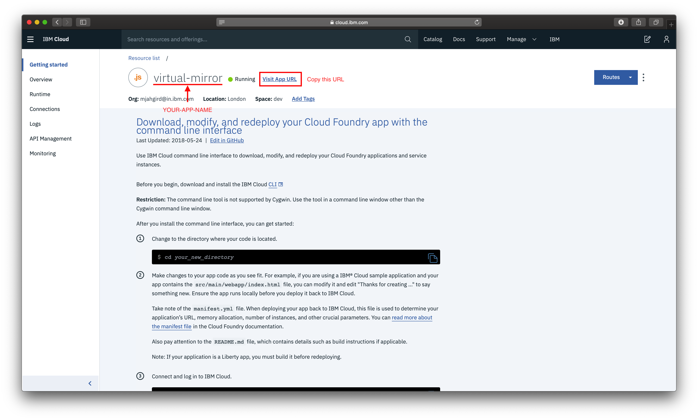

<b>Note: This URL is Important as it will be used in step 5.4.2.</b>

### 4. Watson Visual Recognition Setup
  
  The Watson Visual Recognition service take the user's Image as Input and predicts the age and gender of the user.
  
#### 4.1 Create a Visual Recognition service

* Create a [Visual Recognition service](https://cloud.ibm.com/catalog/services/visual-recognition) in the IBM Cloud.

  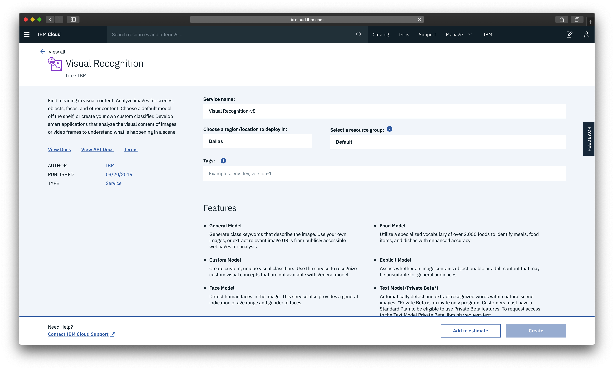

* Copy the Api Key from the Visual Recognition Dashboard as shown bellow.

  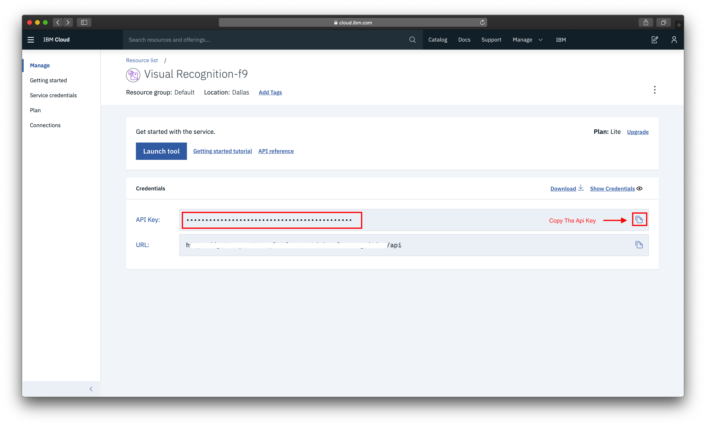

* Go to the `VisualRecognition` directory.
```
$ cd VisualRecognition
```
* In the `credentials.json` file, for the key `vrapi` paste the copied Api key value in the place of `YOUR-API-KEY-HERE` as shown bellow.

<pre><code>
{
    "vrapi": <b>"YOUR-API-KEY-HERE"</b>
}
</code></pre>

#### 4.2 Create a Cloud Foundry Instance & Deploy

* Create a cloud foundry instance [IBM Cloud Foundry Service](https://cloud.ibm.com/catalog/starters/sdk-for-nodejs) and follow set of instructions for deploying JavaScript application to IBM Cloud Foundry.

 

<b>NOTE: Make Sure the Cloud Foundry App gets at least `256MB` of Memory. You can verify it by going to `IBM Cloud Dashboard > Resources > Cloud Foundry Apps > YOUR_APP_NAME`.</b>

* Use IBM Cloud command line interface to download, modify, and redeploy your Cloud Foundry applications and service instances.

* Before you begin, download and install the IBM Cloud [CLI](https://cloud.ibm.com/docs/cli?topic=cloud-cli-ibmcloud-cli&locale=en-us#overview).

* After you install the command line interface, you can get started.

* Go to the `VisualRecognition` directory.

```
$ cd VisualRecognition
```

* Connect and log in to IBM Cloud.

```
$ ibmcloud api https://api.eu-gb.bluemix.net
```

```
$ ibmcloud login -u example@in.ibm.com -o example@in.ibm.com -s dev
```

>NOTE: If you are using a federated ID, use the `-sso` option.
```
$ ibmcloud login  -o example@in.ibm.com -s dev -sso
```
>NOTE: You must add single or double quotes around `username`, `org_name`, and `space_name` if the value contains a space, for example, `-o "my org"`.

* Finally Deploy the application by following command.
```
$ ibmcloud cf push YOUR_APP_NAME
```
>Example: ibmcloud cf push watsonvr

* Once you have deployed the application Make a note of the `URL` of the instance by right clicking on the `Visit app URL` and copying the link.

  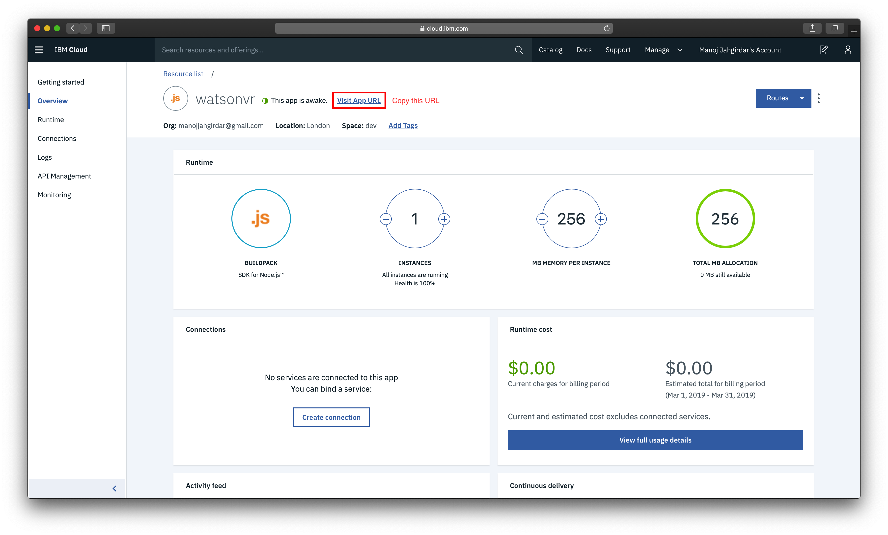

<b>Note: This URL is Important as it will be used in step 5.4.2.</b>

### 5. Mobile Application Setup

  The Mobile Application is the component that connects Virtual Mirror and Recommendation Engine.
#### 5.1 Setup Ionic and MFP CLI
* Install `Node.js` by downloading the setup from https://nodejs.org/en/ (Node.js 8.x or above)
```
$ node --version
v10.15.0
```

* Install Cordova
```
$ sudo npm install -g cordova@8.1.2
$ cordova --version
8.1.2
```

> Note: Please refer MFP documentation for compatible versions of Cordova - https://mobilefirstplatform.ibmcloud.com/tutorials/en/foundation/8.0/application-development/sdk/cordova/

* Install Ionic
```
$ sudo npm install -g ionic@4.12.0
$ ionic --version
4.12.0
```

* Install IBM MobileFirst Platform CLI
```
$ sudo npm install -g mfpdev-cli
$ mfpdev --version
8.0.0-2018121711
```

**Note**: If you are on Windows, instead of using `sudo`, run the above command without `sudo` in a command prompt opened in administrative mode.

> Note: While installing MFP CLI, if you hit an error saying `npm ERR! package.json npm can't find a package.json file in your current directory.`, then it is most likely due to [MFP CLI not being supported in your npm version](https://stackoverflow.com/questions/46168090/ibm-mobile-first-mfpdev-cli-installation-failure). In such a case, downgrade your npm as below, and then install MFP CLI.
`$ sudo npm install -g npm@3.10.10`

* Install Java SDK 8 from https://www.oracle.com/technetwork/java/javase/downloads/jdk8-downloads-2133151.html
```
$ java -version
java version "1.8.0_101"
```
> Note: Java version `1.8.x` is required for cordova to compile apks. Do not Download Java version `11.x`. If you already have java version above `1.8.x` then you can follow the guide in `TROUBLESHOOTING.md` to uninstall the java and reinstall `1.8.x`.

* Install Maven:
On Mac, you can use `brew install` for installing Maven as shown below:
```
$ /usr/bin/ruby -e "$(curl -fsSL https://raw.githubusercontent.com/Homebrew/install/master/install)"
$ brew install maven
$ mvn --version
Apache Maven 3.6.0 ...
```
On Windows, you can follow this [Tutorial](https://www.mkyong.com/maven/how-to-install-maven-in-windows/) to install Maven.

* Install Gradle:
On Mac, you can use `brew install` for installing Maven as shown below:
```
$ brew install gradle
$ gradle --version
Gradle 5.1.1 ...
```
On Windows, you can follow this [Tutorial](https://gradle.org/install/) to install Gradle.

#### 5.2 Create Mobile Foundation service and configure MFP CLI
* In the [IBM Cloud Dashboard](https://cloud.ibm.com/), click on `Catalog` and select [Mobile Foundation](https://cloud.ibm.com/catalog/services/mobile-foundation) service under `Platform` -> `Mobile`. Click on `Create` as shown below.

  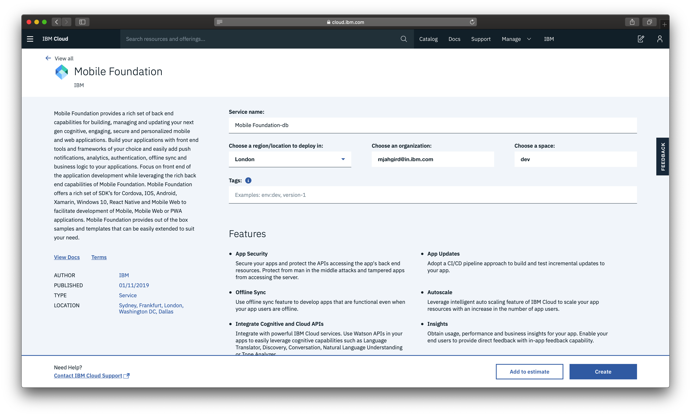

* In the Mobile Foundation service overview page that gets shown, click on `Service credentials`. Expand `View credentials` and make a note of the `url`, `user` and `password` as shown below.

  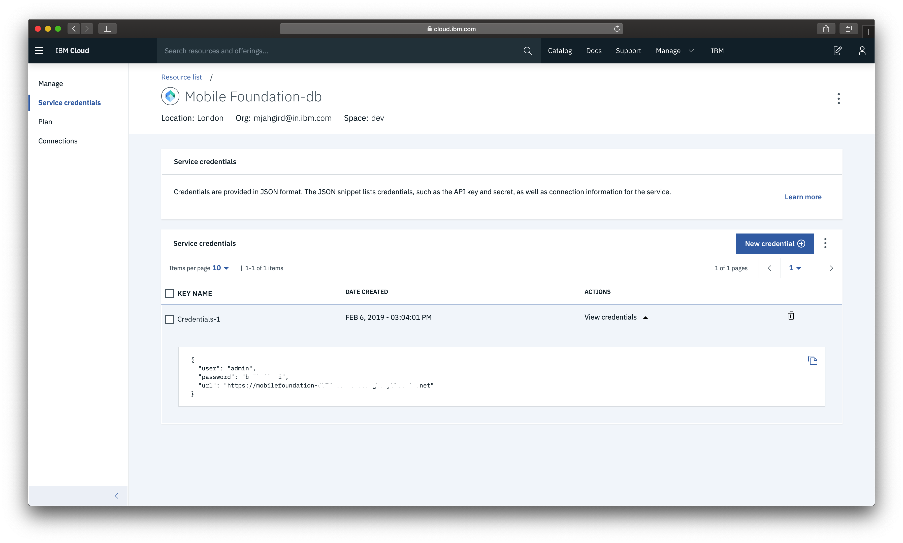

>NOTE: The `user`, `password` and `url` is Important as it will be used in subsequent steps.

<b>NOTE: Make Sure the Cloud Foundry App for Mobile Foundation-Server gets at least `768MB` of Memory.(Recommended is 1GB) You can verify it by going to `IBM Cloud Dashboard > Resources > Cloud Foundry Apps > MobileFoundation-Server` as shown below.</b>

  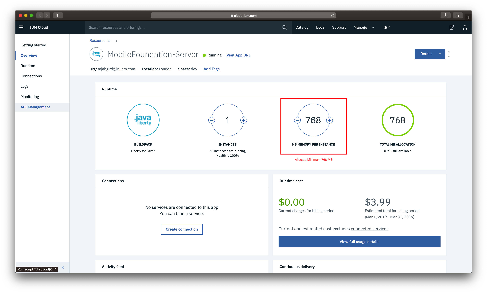

> Note: If *Mobile Foundation* service is not available with your current account type, then you can either:
> - Upgrade your account, and avail the *Mobile Foundation* service's free Developer plan which allows the use of the service free for up to ten daily client devices for development and testing activities, or

* Back on your local machine, configure MFP CLI to work with Mobile Foundation server by running the following command in console.

> Note: For `Enter the fully qualified URL of this server:`, enter the `url` mentioned in credentials followed by `:443` (the default HTTPS port). 
```
$ mfpdev server add
```

* Follow the Instructions.
```
? Enter the name of the new server profile: MyServer
? Enter the fully qualified URL of this server: https://mobilefoundation-xxxx-xxxxx.xx-xx.mybluemix.net:443
? Enter the MobileFirst Server administrator login ID: admin
? Enter the MobileFirst Server administrator password: **********
? Save the administrator password for this server?: Yes
? Enter the context root of the MobileFirst administration services: mfpadmin
? Enter the MobileFirst Server connection timeout in seconds: 30
? Make this server the default?: Yes
Verifying server configuration...
The following runtimes are currently installed on this server: mfp
Server profile 'MyServer' added successfully.
```
* Next Verify If the Server is added.
```
$ mfpdev server info
Name         URL
---------------------------------------------------------------------------------------
MyServer  https://mobilefoundation-xxxx-xxxxxx.xx-xx.mybluemix.net:443  [Default]
---------------------------------------------------------------------------------------
```
>Note: If this step fails check `TROUBLESHOOTING.md` to fix commonly occuring errors.

<b>NOTE: This URL is Important as it will be required in subsequent Steps.</b>

#### 5.3 Customize the App (Optional)
* Go to the `JewelleryStoreApp` directory.
```
$ cd JewelleryStoreApp
```

* Update App ID, Name and Description
in `JewelleryStoreApp/config.xml` as below. Change `id`, `name`, `description` and `author` details as shown bellow.

<pre><code>
&lt;?xml version='1.0' encoding='utf-8'?&gt;
&lt;widget <b>id="com.ibm.mfpthejewellerystore"</b> version="1.0.0" xmlns="http://www.w3.org/ns/widgets" xmlns:cdv="http://cordova.apache.org/ns/1.0" xmlns:mfp="http://www.ibm.com/mobilefirst/cordova-plugin-mfp"&gt;
    <b>&lt;name&gt;The Jewellery Store&lt;/name&gt;
    &lt;description&gt;A virtual mirror integration into ecommerce products with the help of mobilefirst foundation.&lt;/description&gt;
    &lt;author email="example@in.ibm.com" href="/"&gt;Code Patterns Team &lt;/author&gt;</b>
...Specify Cloud Object Storage credentials in MFP Adapter
Recommendation Engine API & Virtual Mirror API in MFP Adapter
</code></pre>

#### 5.4 Deploy the MFP Adapter and Test it
##### 5.4.1 Build and Deploy the MFP adapters
* Go to the `MobileFoundationAdapter` directory inside `JewelleryStoreApp` directory.

```
$ cd MobileFoundationAdapter

$ cd ImageFetch
```
* Add the `URL` along with the port number `:443` appended with `/mfpadmin`, `User` and `Password` in the `pom.xml` file which is present in `ImageFetch` directory as show bellow.

<pre><code>
...
<b>&lt;mfpfUrl&gt;https://mobilefoundation-xxxx-xxxxxx.xx-xx.mybluemix.net:443/mfpadmin &lt;/mfpfUrl&gt;</b>
<b>&lt;mfpfUser&gt;admin &lt;/mfpfUser&gt;</b>
<b>&lt;mfpfPassword&gt;******** &lt;/mfpfPassword&gt;</b>
&lt;mfpfRuntime&gt;mfp &lt;/mfpfRuntime&gt;
...
</code></pre>

* Build the `ImageFetch` adapter as shown below.
```
$ mfpdev adapter build
Building adapter...
Successfully built adapter
```
* Deploy the adapter as shown bellow.
```
$ mfpdev adapter deploy
Verifying server configuration...
Deploying adapter to runtime mfp on https://mobilefoundation-xxxx-xxxxxx.xx-xx.mybluemix.net:443/mfpadmin...
Successfully deployed adapter
```

> Note: In [Step 5.2], if you specified `No` to `Make this server the default?`, then you need to specify the name of your server profile (`MyServer` in our case) at the end of `mfpdev adapter deploy` command as shown below.
```
$ mfpdev adapter deploy MyServer
```
##### 5.4.2 Launch MFP dashboard and update adapter configurations
Launch MFP Dashboard as below:
  * In the [IBM Cloud dashboard](https://cloud.ibm.com/dashboard/), under `Cloud Foundry Services`, click on the `Mobile Foundation` service you created in [Step 5.2]. The service overview page that gets shown, will have the MFP dashboard embedded within it. You can also open the MFP dashboard in a separate browser tab by appending `/mfpconsole` to the *url* mentioned in [Step 5].
  * Inside the MFP dashboard, in the list on the left, you will see the `ImageFetch` adapter listed.

Update MFP Adapter configuration as below:
  * Inside the MFP dashboard, click on the `ImageFetch` adapter. Under `Configurations` tab, you should see the various properties for accessing Cloud Object Storage, recommendation Engine Api, Visual Recognition and virtual Mirror Api as shown below.

     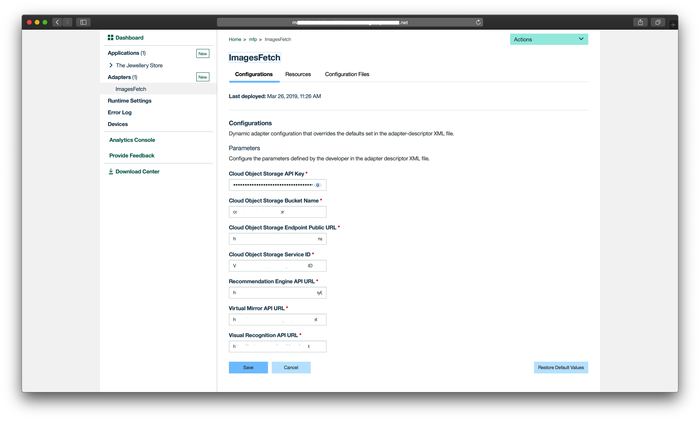

  * The `Cloud Object Storage Bucket Name` can be found in step 2.1.1, `Cloud Object Storage API Key` can be found in step 2.1.2, `Cloud Object Storage Endpoint` can be found by going to [Cloud Object Storage Dashboard](https://cloud.ibm.com/objectstorage/) clicking on `Endpoint` and the public link for Resiliency and Location as selected in step 2.1.1 and `Cloud Object Storage Service ID` can be found in step 2.1.2.

  * The `Recommendation Engine API URL` can be found in step 2.7, `Virtual Mirror API URL` can be found in step 3, `Visual Recognition API URL` can be found in step 4.2.

  * Click on `Resources` tab. You should see the various REST APIs exposed by `ImageFetch` adapter as shown below.

     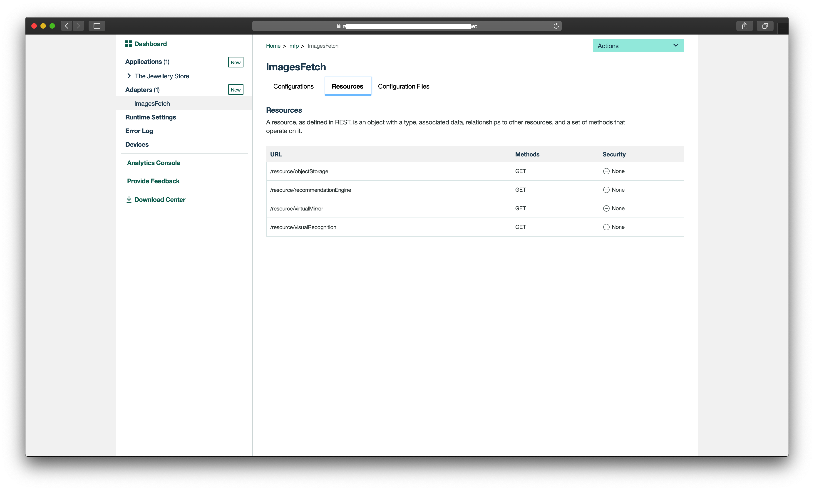

##### 5.4.3 Test the ImageFetch adapter
To Test the adapter use any REST Clients like [Postman](https://www.getpostman.com/downloads/).
After Installing postman type the `url` created in [step 5.2] and append it with `/mfp/api/adapters/ImagesFetch/resource` and `/objectStorage` to test whether the adapter is establishing connection with Cloud Object Storage.

>Example: `https://mobilefoundation-xxxx-xxxxxx.xx-xx.mybluemix.net/mfp/api/adapters/ImageFetch/resource/objectStorage`

 * Now click on `Send` button to run the `GET /` API. The API response should get shown in the `Response Body` as shown in snapshot below.

 * The GET API on `/objectStorage` should return a JSON object containing `baseUrl` and `authorizationHeader` as shown below.

  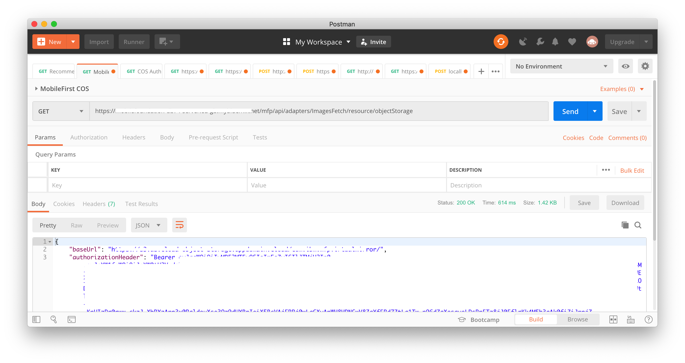

 * The GET API on `/recommendationEngine` should return a JSON object containing `recommendationEngineApi` as shown below.

>Example: `https://mobilefoundation-xxxx-xxxxxx.xx-xx.mybluemix.net/mfp/api/adapters/ImageFetch/resource/recommendationEngine`

   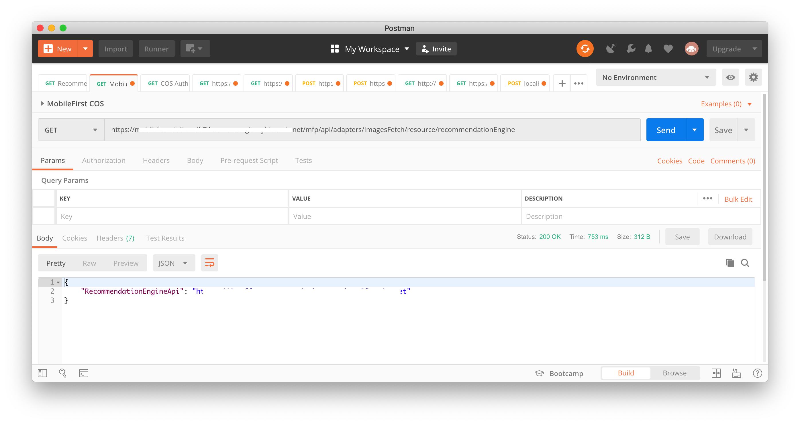

 * The GET API on `/visualRecognition` should return a JSON object containing `VisualRecognitionApi` as shown below.

 >Example: `https://mobilefoundation-xxxx-xxxxxx.xx-xx.mybluemix.net/mfp/api/adapters/ImageFetch/resource/visualRecognition`

   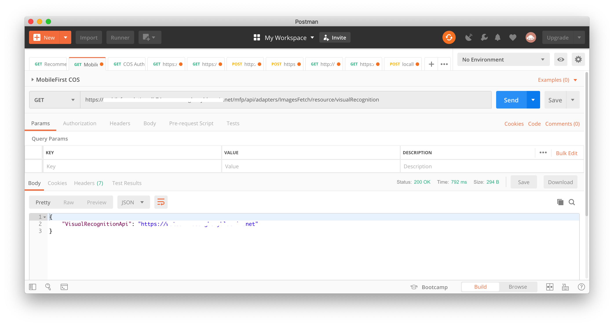

* The GET API on `/virtualMirror` should return a JSON object containing `VirtualMirrorApi` as shown below.

 >Example: `https://mobilefoundation-xxxx-xxxxxx.xx-xx.mybluemix.net/mfp/api/adapters/ImageFetch/resource/virtualMirror`

   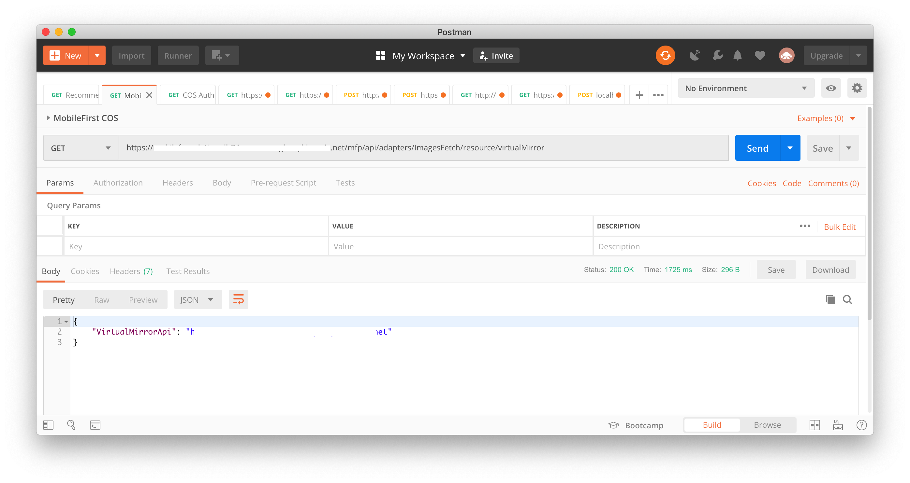

#### 5.5 Run application on Android phone
##### 5.5.1 Install Android Studio and Android SDK platform
* Download and install Android Studio from https://developer.android.com/studio/
* Install Android SDK Platform 23 (or higher) as below:
  - Launch Android Studio.
  - Click on `Configure` -> `SDK Manager`
  - Make a note of the `Android SDK Location`.
  - Under `SDK Platforms`, select `Android 6.0 (Marshmallow) API Level 23` or higher. Click `Apply` and then click `OK`. This will install Android SDK Platform on your machine.

##### 5.5.2  Enable developer options and USB debugging on your Android phone
* Enable USB debugging on your Android phone as per the steps in https://developer.android.com/studio/debug/dev-options
  - Launch the Settings app on your phone. Select `About Device` -> `Software Info`. Tap `Build number` 7 times to enable developer options.
  - Return to Settings list. Select `Developer options` and enable `USB debugging`.
* If you are developing on Windows, then you need to install the appropriate USB driver as per instructions in https://developer.android.com/studio/run/oem-usb.
* Connect the Android phone to your development machine by USB cable, you will get a prompt displaying adb access required, `allow` the access.

> Note: If you have android [adb tools](https://developer.android.com/studio/command-line/adb) you can check whether your device is connected or not by entering `adb devices`.

##### 5.5.3 Register the Virtual Mirror App to MFP server

* Go back to `JewelleryStoreApp` directory.
```
$ cd ../JewelleryStoreApp
```

* Register the app as Shown bellow.
```
$ mfpdev app register
Verifying server configuration...
Registering to server:'https://mobilefoundation-xxxx-xxxxxx.xx-xx.mybluemix.net:443' runtime:'mfp'
Updated config.xml file located at: .../Ionic-MFP-App/IonicMobileApp/config.xml
Run 'cordova prepare' to propagate changes.
Registered app for platform: android
```
> Note: In [Step 5.2], if you specified `No` to `Make this server the default?`, then you need to specify the name of your server profile (`MyServer` in our case) at the end of `mfpdev app deploy` command as shown below.
`$ mfpdev app register MyServer`

> Note: To Propagate changes by running `cordova prepare`


##### 5.5.5 Build/Run the Ionic application on Android phone

* Build Android application
```
$ ionic cordova build android
```
<b>Note: The `build` & `run` commands should be executed in the `JewelleryStoreApp` directory and not else where.</b>

<b>Note: Make sure you Connect the Android phone to your development machine by USB cable, and accept the adb access permissions.</b>

* Run application on Android device
```
$ ionic cordova run android
```
  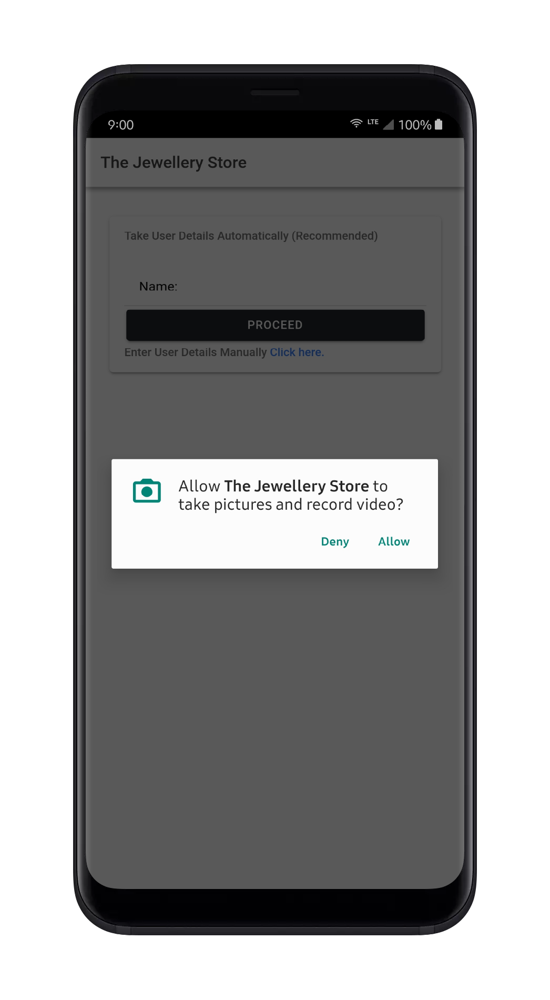  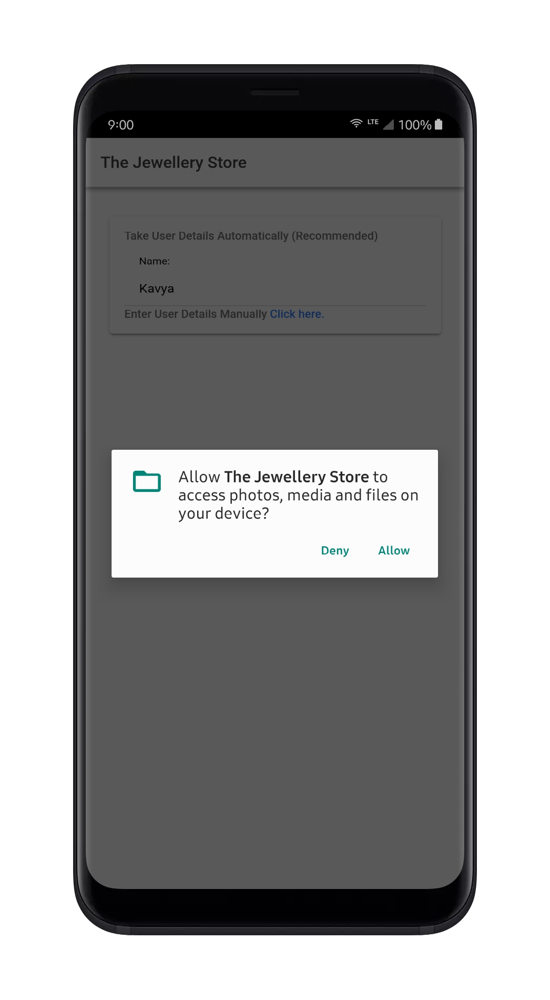

* Allow the <b>Camera Permission</b> and <b>Storage Permission</b> when prompted. Without this the virtual mirror will not work.
  >NOTE: <b>Storage Permission</b> will be asked only if you choose to select a picture from camera.
  
  >NOTE: If there is not camera prompt in your mobile device follow step 4 from `TROUBLESHOOTING.md` to fix it.
  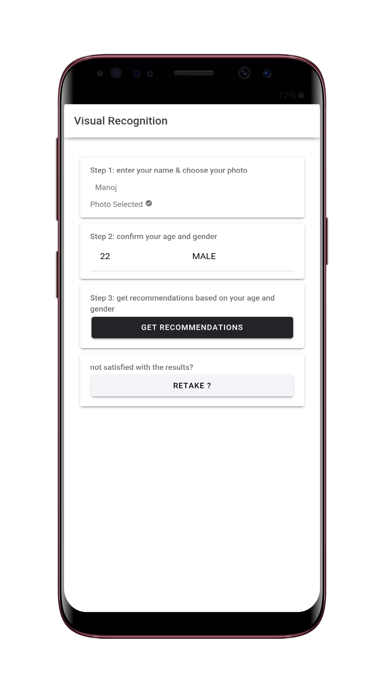 

* To get your age and gender either click a picture or choose an existing picture.

  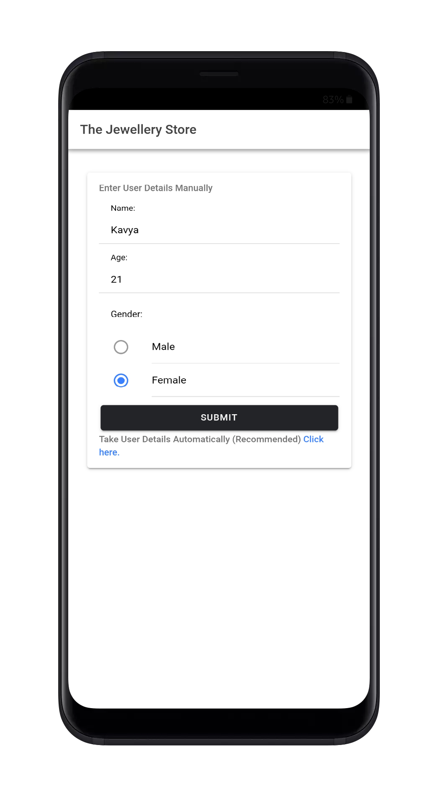 
  
* If you choose to enter age and gender manually you can click on the blue link in the app which says `click here`.

  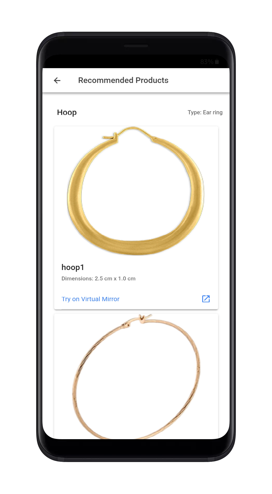 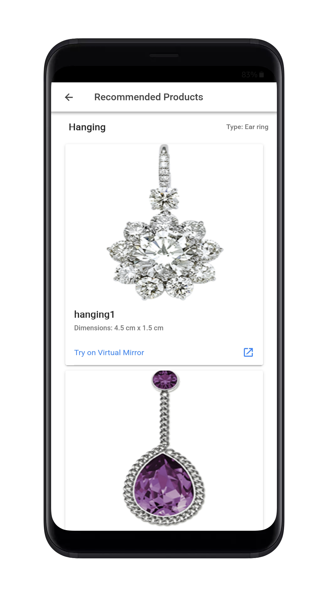 

* A list of Jewellery will be Recommended based on your age and gender.

  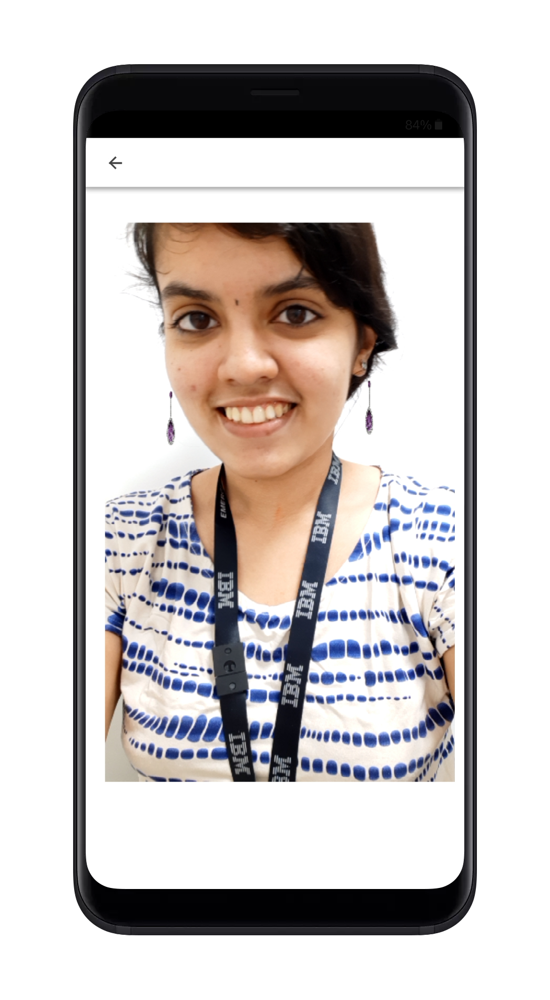 

* You can select any Jewellery to view it virtually on your face in real-time.


##### 5.5.6 Update App Logo and Splash (Optional)

Reference: Automating Icons and Splash Screens https://blog.ionicframework.com/automating-icons-and-splash-screens/

Copy your desired app icon to `JewelleryStoreApp/resources/icon.png` and app splash to `JewelleryStoreApp/resources/splash.png`.

```
$ ionic cordova resources
```

For running `ionic cordova resources` command, you would need to sign up on [ionicframework.com](https://ionicframework.com/) and specify the credentials on the command line.

#### 5.6 Build APK for uploading to Google Play Store (Optional)

Reference: https://ionicframework.com/docs/intro/deploying/

* Add following lines at the end of `JewelleryStoreApp/platforms/android/app/src/main/proguard-project-mfp.txt`:
```
-dontwarn okhttp3.internal.huc.**
```

* Create release build as below:
```
$ cd ../JewelleryStoreApp

$ ionic cordova build android --prod --release
```

* Set `ANDROID_HOME` environment variable as per instructions in [Step x.x]. On Mac, this is usually:
```
export ANDROID_HOME=/Users/<username>/Library/Android/sdk
```

* Zip align release build as below:
```
$ cd ./platforms/android/build/outputs/apk/
$ ls
android-release-unsigned.apk
$ $ANDROID_HOME/build-tools/28.0.3/zipalign -v -p 4 android-release-unsigned.apk android-release-unsigned-aligned.apk
$ ls
android-release-unsigned-aligned.apk	android-release-unsigned.apk
```

* Create self signing certificate as below:

Make a note of the `Keystore password` that you set. You would need it for signing your APK.

```
$ keytool -genkey -v -keystore my-release-key.jks -keyalg RSA -keysize 2048 -validity 10000 -alias my-alias

Enter keystore password:
Re-enter new password:
What is your first and last name?
  [Unknown]:  Manoj Jahgirdar
What is the name of your organizational unit?
  [Unknown]:  ISL
What is the name of your organization?
  [Unknown]:  IBM
What is the name of your City or Locality?
  [Unknown]:  Bangalore
What is the name of your State or Province?
  [Unknown]:  Karnataka
What is the two-letter country code for this unit?
  [Unknown]:  IN
Is CN=Manoj Jahgirdar, OU=ISL, O=IBM, L=Bangalore, ST=Karnataka, C=IN correct?
  [no]:  yes

Generating 2,048 bit RSA key pair and self-signed certificate (SHA256withRSA) with a validity of 10,000 days
	for: CN=Manoj Jahgirdar, OU=ISL, O=IBM, L=Bangalore, ST=Karnataka, C=IN
Enter key password for <my-alias>
	(RETURN if same as keystore password):
[Storing my-release-key.jks]

$ ls
android-release-unsigned-aligned.apk	android-release-unsigned.apk		my-release-key.jks
```

* Self sign APK as below:
```
$ $ANDROID_HOME/build-tools/28.0.3/apksigner sign --ks my-release-key.jks --out thejewellerystore.apk android-release-unsigned-aligned.apk
Keystore password for signer #1:
$ ls
android-release-unsigned-aligned.apk	my-release-key.jks
android-release-unsigned.apk		thejewellerystore.apk
$
```

* Distribute `thejewellerystore.apk` by uploading to Google Play Store or to your company's internal App store.

<!--Optionally, include any troubleshooting tips (driver issues, etc)-->

# Troubleshooting

### Debugging Android hybrid app using Chrome Developer Tools

Please see [troubleshooting guide](TROUBLESHOOTING.md) for solutions to some commonly occuring problems.

* Install Google Chrome
* Open Google Chrome. Open URL `chrome://inspect/#devices`
* Connect your mobile phone to the deployment device via USB cable and you should see your device name listed on the page as shown.

  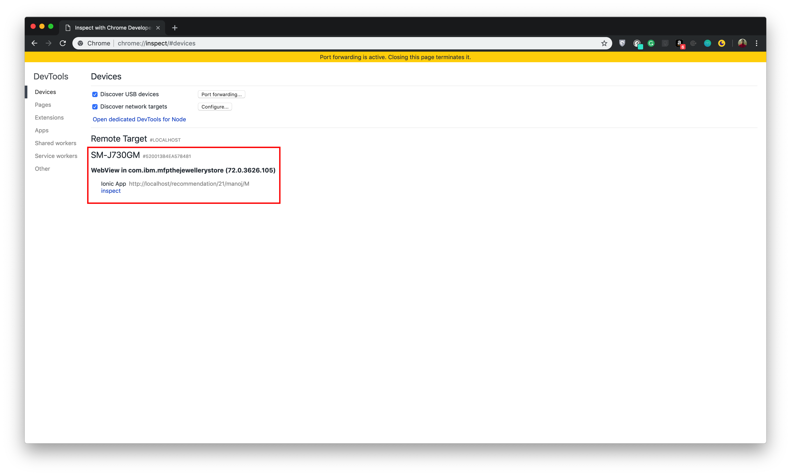

* Under `Devices`, click on `inspect` below your connected device.

  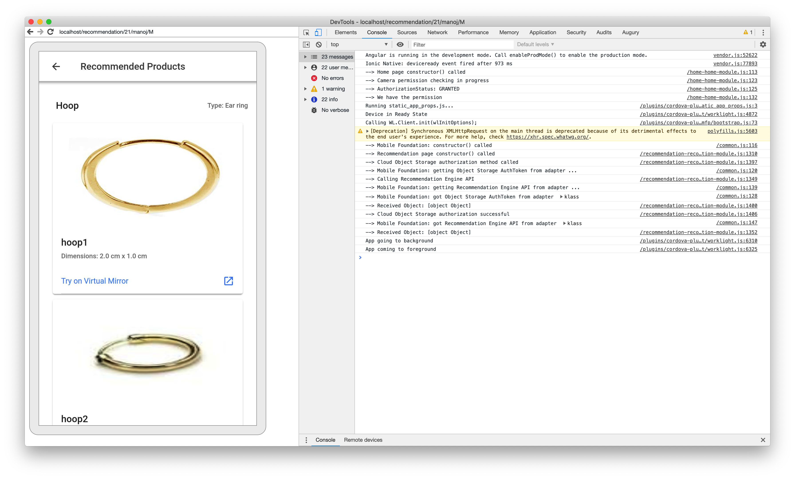

* You can see the console logs here for every action that the app performs.

<!-- keep this -->
## License

[Apache 2.0](LICENSE)
